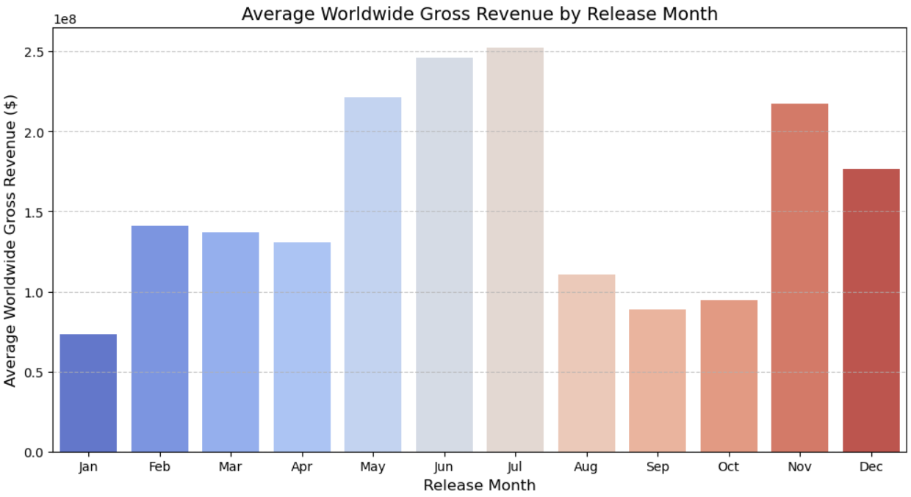
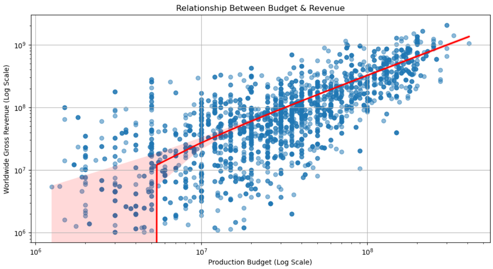

# Movie Industry Business Analysis Project

## Overview
This project explores key factors that contribute to a movie's financial success, leveraging data from multiple sources to provide actionable insights for industry stakeholders. Through Exploratory Data Analysis (EDA) and data-driven recommendations, we aim to optimize decision-making for film studios, producers, and investors.

## 2.0 Business Understanding
### Problem Statement
Our company now sees all the big companies creating original video content and they want to get in on the fun. They have decided to create a new movie studio, but they don’t know anything about creating movies. We are charged with exploring what types of films are currently doing the best at the box office. Then translate the findings into actionable insights that the head of our company's new movie studio can use to help decide what type of films to create.

## Project Objectives
### Key Business Questions:
- Using SQL for data extraction, Python for data analysis and visualization, and statistical techniques for trend analysis, we aim to:
1. Identify the most profitable film genres to prioritize.
2. Analyze the impact of budget on revenue and suggest optimal budget allocation.
3. Assess how critical and audience ratings affect box office success.
4. Determine seasonal trends to optimize movie release timing.
5. Examine Domestic and international market trends for domestic and global distribution strategies.

This analysis will help the company's leadership make informed, data-driven decisions on film production investments, ensuring maximum profitability and industry competitiveness.

## Data Understanding & Analysis
To conduct this analysis, we sourced data from multiple authoritative platforms in the film industry. These sources provide comprehensive insights into box office performance, audience reception, and critical reviews.

## Data Sources & Description
* [Box Office Mojo](https://www.boxofficemojo.com/) - Provides detailed box office revenue data, including domestic and international earnings.
* [IMDB](https://www.imdb.com/) - Offers extensive movie metadata, including genre, director, budget, and user ratings.
* [Rotten Tomatoes](https://www.rottentomatoes.com/) - Aggregates critic and audience reviews, helping assess the impact of ratings on movie success.
* [TheMovieDB](https://www.themoviedb.org/) - Supplies information on movie production, popularity, and cast details.
* [The Numbers](https://www.the-numbers.com/) - Provides financial insights, including movie production budgets and revenue figures.

By integrating data from these sources, we ensure a holistic, data-driven approach to understanding industry trends and making informed recommendations for our new movie studio.

## Visualizations:
1. Profitability by Genre
This visualization highlights the most and least profitable movie genres, helping the company decide which film categories to invest in.

2. Revenue by Release Month (Seasonality Effect)
This visualization reveals the best and worst months for movie releases, ensuring strategic scheduling for maximum box office returns.

3. Budget vs. Revenue (Investment Efficiency Analysis)
This scatter plot analyzes how movie budgets correlate with worldwide revenue, helping guide budget allocation decisions.

These visualizations are presented in the project’s Jupyter notebook and integrated into an interactive Tableau dashboard for ease of exploration. View the interactive dashboard here:

## Key Findings
1️⃣ **Genre Profitability**

🎭 Comedy, Drama, and Action & Adventure are the most profitable genres.

🚀 Science Fiction & Fantasy films have high earning potential, especially in recent years.

❌ Western, Special Interest, and Sports & Fitness films have limited audience demand.

2️⃣ **Budget vs. Revenue**

💰 Higher budgets generally lead to higher revenue, but not always proportionally.

🎬 Horror movies achieve high profits on low budgets, making them a great low-risk investment.

🎥 Action & Adventure and Sci-Fi films demand large budgets but yield significant returns.

3️⃣ **Critical Ratings vs. Box Office**

⭐ Highly rated films tend to perform better.

🎞️ Drama & Sci-Fi benefit the most from strong ratings.

🤣 Comedy & Horror are polarizing—audience reception significantly impacts success.

4️⃣ **Highest Earning Studios**

🏆 Disney, Warner Bros., and Universal dominate the box office due to strong franchises and marketing.

5️⃣ **Seasonality in Revenue**

📈 Best release months: June, July, May, November, and December.

📉 Worst months for releases: January, September, and October.

🔄 Moderate months: February, March, April, and August.

6️⃣ **Market Trends**

🌍 International box office often surpasses domestic earnings, especially for blockbusters.

🎭 Comedy & Drama perform better domestically, showing cultural preferences.

 ## Recommendations
✔️ **Invest in High-Profit Genres**
🎬 Prioritize Comedy, Drama, Action & Adventure, and Sci-Fi & Fantasy films for maximum returns.

✔️ **Strategic Budget Allocation**
💵 Control high-budget productions to ensure proportional revenue returns.
🎭 Horror films offer great ROI on low budgets, making them a valuable investment.

✔️ **Leverage Ratings for Success**
📢 Enhance storytelling, casting, and audience engagement to boost ratings and profitability.

✔️ **Expand Global Market Reach**
🌍 Action, Sci-Fi, and Fantasy perform best internationally.
🎥 Studios should localize content (subtitles, dubbing) for broader reach.

✔️ **Adapt to Industry Trends**
📉 Declining box office revenue post-2016 suggests streaming impacts traditional cinema.
💡 Studios should consider hybrid release strategies (theatrical + streaming).

✔️ **Optimize Movie Release Timing**
📆 Blockbusters should launch in high-earning months (June, July, May, November, December).
🚫 Avoid major releases in January, September, and October due to lower revenue trends.

## Conclusion

- **Highest earning genres:** Action, Adventure, and Science Fiction films generate the highest revenue.

- **Optimal budget range:** Mid-to-high-budget films ($50M–$150M) tend to yield the best return on investment.

- **Top-performing studios:** Major studios like Disney, Warner Bros., and Universal have a track record of consistent box office success.

- **Best release months:** June, July, November, and December maximize revenue potential, while January, September, and October perform poorly.

- **Impact of ratings:** Higher critic and audience ratings positively correlate with box office earnings

## Limitations & Future Work
⚠️ **Limitations**
📉 Incomplete Data: Streaming platforms' impact on box office is not fully covered.
🎭 Changing Industry Trends: Viewer preferences evolve—future studies should account for emerging genres.

🚀 **Future Work**
🤖 Machine Learning for Predicting Movie Success.
🌍 Deeper analysis of global vs. domestic performance by region.
🔄 Impact of streaming platforms on box office earnings.

## 🙌 Acknowledgments
We would like to express our gratitude to:

🎥 Data Sources: IMDb, Box Office Mojo, and other platforms for providing invaluable movie industry data.
🎓 Moringa School: For supporting our learning journey.
👥 Project Team (Group 5): For their dedication, insights, and collaboration in making this project a success.

This analysis is a step toward understanding movie industry trends, and we hope it serves as a valuable reference for decision-makers. 🎬

### 📌 Let’s Connect!
🔗 LinkedIn: https://www.linkedin.com/in/allan-ofula-b2804911b/
🐙 GitHub: https://allan-ofula.github.io/, https://github.com/Allan-Ofula